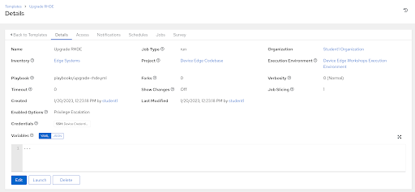
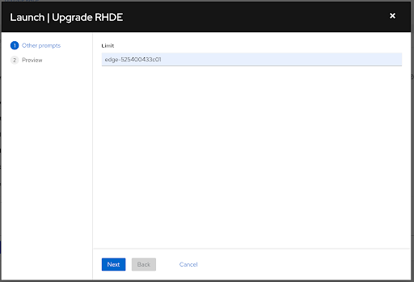
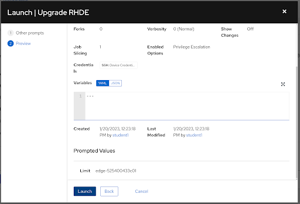

# Workshop Exercise 0.1 - Automated Device Upgrade

## Table of Contents

* [Objective](#objective)
* [Step 1 - Reviewing How to Upgrade RHDE](#step-1---reviewing-how-to-upgrade-rhde)
* [Step 2 - Creating a Playbook to Upgrade RHDE](#step-2---creating-a-playbook-to-upgrade-rhde)
* [Step 3 - Creating a Job Template for our Upgrade Playbook](#step-3---creating-a-job-template-for-our-upgrade-playbook)
* [Step 4 - Running The Upgrade Job](#step-4---running-the-upgrade-job)
* [Solutions](#solutions)

## Objective

The purpose of this exercise is to review how RHDE is updated, and then automate the process. Once finished, you should be able to run a job template in Ansible Controller, specify what version of an image you'd like, and then let Ansible handle the rest.

> Note:
>
> This exercise is reused at a few different times throughout the workshop, so if you've already completed some of these steps, jump to [step 4](#step-4---running-the-upgrade-job).

### Step 1 - Reviewing How to Upgrade RHDE

Red Hat Device Edge is rpm-ostree based, and so upgrades are handled differently than traditional Red Hat Enterprise Linux.

The `rpm-ostree status` command will print out information about the running image. On this system, I have a newer image deployed to the system, but it isn't the current running instance, as denoted by the star in front of the image labeled `Version: 1.0.0`.
```
[root@Colossus ~]# rpm-ostree status
State: idle
Deployments:
  rhel:rhel/8/x86_64/edge
                  Version: 2.0.0 (2023-01-20T13:34:53Z)
                     Diff: 5 added

* rhel:rhel/8/x86_64/edge
                  Version: 1.0.0 (2023-01-19T18:51:54Z)
```

To manually upgrade a device, run the `rpm-ostree upgrade` command:
```
[root@Colossus ~]# rpm-ostree upgrade
⠤ Writing objects: 1 
Writing objects: 1... done
Staging deployment... done
Added:
  libev-4.24-6.el8.x86_64
  libuv-1:1.41.1-1.el8_4.x86_64
  libwebsockets-4.0.1-2.el8.x86_64
  mosquitto-1.6.15-1.el8.x86_64
  nodejs-1:16.18.1-3.module+el8.7.0+17465+1a1abd74.x86_64
Run "systemctl reboot" to start a reboot

```

Then reboot the device to boot into the newly deployed image.

This approach is fine for testing, however isn't viable at scale. We're going to automate this process.

### Step 2 - Creating a Playbook to Upgrade RHDE

The flow of the playbook will be as follows:
1. Attempt to upgrade the device
2. If the device was upgraded, reboot

For this workshop, we're controlling access to new image versions at the repo level, so our playbook can be more simplistic.

Return to your code repo and open back up your favorite editor. In the `playbooks/` directory, create a new playbook called `upgrade-rhde.yml`.
```yaml
---

- name: upgrade RHDE
  hosts:
    - all
  tasks:
    - name: upgrade RHDE
      ansible.posix.rpm_ostree_upgrade:
      register: rhde_upgraded
  post_tasks:
    - name: reboot device
      ansible.builtin.reboot:
        reboot_command: systemctl reboot
        reboot_timeout: 300
      when:
        - rhde_upgraded.changed
```

The `ansible.posix.rpm_ostree_upgrade` command will handle checking for a new image version, and if one is available, upgrading the system.

Once you've finished your playbook, push it up into your code repository.

### Step 3 - Creating a Job Template for our Upgrade Playbook

> Note:
>
> Ensure you've synced your project before attempting to create a job template.

Now that we have a playbook, we can create a job template to run our playbook.

Under **Resources** > **Templates**, select **Add** > **Add job template** and enter the following information:

<table>
  <tr>
    <th>Parameter</th>
    <th>Value</th>
  </tr>
  <tr>
    <td>Name</td>
    <td>Upgrade Edge Device</td>
  </tr>
  <tr>
    <td>Inventory</td>
    <td>Edge Systems</td>
  </tr>
  <tr>
    <td>Project</td>
    <td>Device Edge Codebase</td>
  </tr>
  <tr>
    <td>Execution Environment</td>
    <td>Device Edge Workshops Execution Environment</td>
  </tr>
  <tr>
    <td>Playbook</td>
    <td>playbooks/upgrade-rhde.yml</td>
  </tr>
  <tr>
    <td>Credentials</td>
    <td><ul><li>✓ Device Credentials</li></ul></td>
  </tr>
  <tr>
    <td>Limit</td>
    <td><ul><li>✓ Prompt on launch</li></ul></td>
  </tr>
   <tr>
    <td>Options</td>
    <td><ul><li>✓ Privilege Escalation</li></ul></td>
  </tr> 
</table>

Remember to click **Save**.

### Step 4 - Running The Upgrade Job

On the **Templates** page, click on the rocket ship to launch our newly created job template. A pop-up should appear in your browser asking for you to input the limit for the job.

Enter the name of your edge device, for example: `edge-525400433c01`, then hit **Next**. Ensure your limit looks correct on the next screen, then hit the **Launch** button.

Ideally, your edge device will have upgraded and rebooted, with Ansible Controller showing `changed` for the `upgrade RHDE` and `reboot device` tasks.

This playbook is idempotent: if the device does not see an available upgrade, nothing will happen and it will not reboot.


### Solutions

Job template:



Entering a limit:



Confirm Input:



---
**Navigation**

[Click here to return to the Workshop Homepage](../README.md)