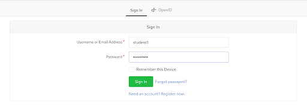
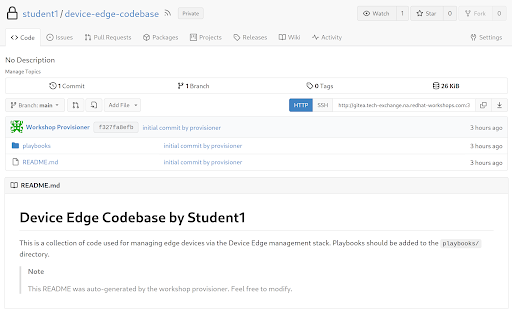

# Workshop Exercise - Investigating Source Control

## Table of Contents

* [Objective](#objective)
* [Step 1 - Logging In](#step-1---logging-in)
* [Step 2 - Your Controller Organization](#step-2---your-controller-organization)
* [Step 3 - Credentials](#step-3---credentials)
* [Step 4 - Project](#step-4---project)
* [Step 5 - Inventories](#step-5---inventories)
* [Step 6 - Job Templates](#step-6---job-templates)
* [Step 7 - Execution Environments](#step-7---execution-environments)

## Objective

In this exercise, we are going to get logged into Gitea and explore the content of your instance.

This exercise will cover

* Logging into Gitea
* Exploring the pre-populated repo

### Step 1 - Logging In

> Note: If you are using an edge device on-site: your instructor will provide the IP address/DNS entry of the Gitea instance that will be running locally. Optionally, more information can be found on your student page.

> Note: If you are using Gitea in AWS: the login information can be found on your student page.

After entering the URL in a browser, you will be greeted with the Gitea login page. To log in, the username will be "student$(your_student_number)", such as `student1`, and the pasword is located on your student page.

 
### Step 2 - The Gitea Dashboard

Gitea features a lightweight dashboard that shows an activity stream and lists your repos on the right hand side. There should be information about the workshop provisioner creating and performing an initial push of some code:

### Step 3 - The Device Edge Codebase Repo

On the right-hand side of the Gitea dashboard is a link to a repository called `device-edge-codebase` which will be used to contain code for this workshop. Take a look at the pre-populated playbook in the `playbooks/` directory, and denote the http(s)/git addresses used to push and pull from this repository.

> Note: The external SSH port for Gitea is `2222`. Be sure to append the correct port to `git` commands if using git over SSH instead of over http(s).

---
**Navigation**

[Previous Excercise](../1.2-controller-intro) | [Next Exercise](../1.4-device-intro)

[Click here to return to the Workshop Homepage](../README.md)
