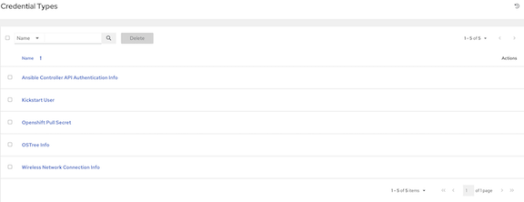
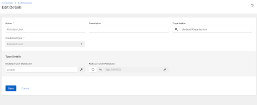
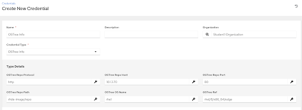
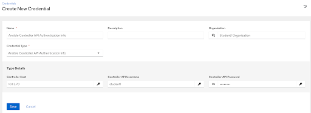
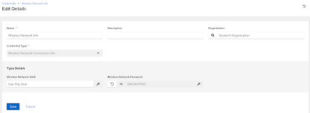
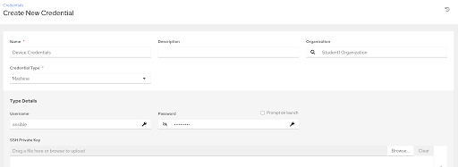

# Workshop Exercise 2.2 - Creating Custom Credentials for Kickstart Template

## Table of Contents

* [Objective](#objective)
* [Quick Review](#quick-review)
* [Step 1 - Reviewing Created Custom Credential Types](#step-1---reviewing-created-custom-credential-types)
* [Step 2 - Creating Credentials from Custom Credential Types](#step-2---creating-credentials-from-custom-credential-types)
* [Step 3 - Creating a Machine Credential](#step-3---creating-a-machine-credential)
* [Solutions](#solutions)

## Objective

In this exercise, we're going to leverage the [custom credential types](https://docs.ansible.com/ansible-tower/latest/html/userguide/credential_types.html) feature of Ansible Controller to securely store some information that'll be templated into our kickstart files.

This gives us some additional functionality because:
1. Sensitive information will be stored in Ansible Controller securely
2. Multiple credentials can be built off the same credential to allow for provisioning differences between sites/geos/etc.

## Quick Review

In the [previous exercise](../2.2-kickstart-template/), we set up our kickstart template with some variables, specifically for the following information:

For the user created during kickstart:
<table>
  <tr>
    <th>Variable</th>
    <th>Description</th>
  </tr>
  <tr>
    <td>kickstart_user_username</td>
    <td>The username of the user that will be created on the system</td>
  </tr>
  <tr>
    <td>kickstart_user_password</td>
    <td>The password of the user that will be created on the system</td>
  </tr>
</table>

For the ostree repo containing where to pull the commit from:
<table>
  <tr>
    <th>Variable</th>
    <th>Description</th>
  </tr>
  <tr>
    <td>ostree_repo_protocol</td>
    <td>The protocol to use when accessing the repo (http/https)</td>
  </tr>
  <tr>
    <td>ostree_repo_host</td>
    <td>The host of the ostree repo</td>
  </tr>
  <tr>
    <td>ostree_repo_port</td>
    <td>The port to use when accessing the repo</td>
  </tr>
  <tr>
    <td>ostree_repo_path</td>
    <td>The path on the server where the repo can be accessed</td>
  </tr>
  <tr>
    <td>ostree_os_name</td>
    <td>The name of the OS in the repo</td>
  </tr>
  <tr>
    <td>ostree_ref</td>
    <td>The ref to pull and deploy</td>
  </tr>
</table>

For authenticating to the Ansible Controller API:
<table>
  <tr>
    <th>Variable</th>
    <th>Description</th>
  </tr>
  <tr>
    <td>controller_host</td>
    <td>Where Ansible Controller is running</td>
  </tr>
  <tr>
    <td>controller_api_username</td>
    <td>The username to use to authenticate to the Ansible Controller API</td>
  </tr>
  <tr>
    <td>controller_api_password</td>
    <td>The password to use to authenticate to the Ansible Controller API</td>
  </tr>
</table>

Optionally, if using wifi for physical devices:
<table>
  <tr>
    <th>Variable</th>
    <th>Description</th>
  </tr>
  <tr>
    <td>wifi_network</td>
    <td>The wireless network's SSID</td>
  </tr>
  <tr>
    <td>wifi_password</td>
    <td>The wireless network's password</td>
  </tr>
</table>

### Step 1 - Reviewing Created Custom Credential Types

Under the **Administration** tab, select **Credential Types** to view the available custom credential types. There should be three available corresponding to the information above in the [review](#quick-review) section:

Select the **Kickstart User** credential type to view more information:

Custom credential types are composed to two main concepts: Inputs and Injectors.
- Inputs are how information is retrieved from the user when creating a credential from this credential type. Fields can be selection based or free-form text entry, and can be marked as secret so their value isn't displayed again after entering it.
- Injectors are how the inputs are translated into actual Ansible variables for use during execution. Here, we're injecting the entered information as extra variables, meaning they behave exactly like doing `--extra-vars` on the command line.

Review all three types for familiarity.

### Step 2 - Creating Credentials from Custom Credential Types

Custom credential types behave exactly like other credential types, meaning we simply need to create a new credential and select the type we want.

First, let's create a credential for our kickstart user info. Under **Resources**, select **Credentials**, and clock the **Add** button at the top of the page.

Enter the following information to create a new credential:
<table>
  <tr>
    <th>Parameter</th>
    <th>Value</th>
  </tr>
  <tr>
    <td>Name</td>
    <td>Kickstart User</td>
  </tr>
  <tr>
    <td>Organization</td>
    <td>(Your_Student_Organization)</td>
  </tr>
  <tr>
    <td>Credential Type</td>
    <td>Kickstart User</td>
  </tr>
  <tr>
    <td>Kickstart User Username</td>
    <td>ansible</td>
  </tr>
  <tr>
    <td>Kickstart User Password</td>
    <td>(a-password-of-your-choice)</td>
  </tr>
</table>

Once complete, click **Save**

Repeat the process for OSTree info:
<table>
  <tr>
    <th>Parameter</th>
    <th>Value</th>
  </tr>
  <tr>
    <td>Name</td>
    <td>OSTree Info</td>
  </tr>
  <tr>
    <td>Organization</td>
    <td>(Your_Student_Organization)</td>
  </tr>
  <tr>
    <td>Credential Type</td>
    <td>OSTree Info</td>
  </tr>
  <tr>
    <td>OSTree Repo Protocol</td>
    <td>http</td>
  </tr>
  <tr>
    <td>OSTree Repo Host</td>
    <td>the-kickstart-host-from-student-page</td>
  </tr>
  <tr>
    <td>OSTree Repo Port</td>
    <td>80</td>
  </tr>
  <tr>
    <td>OSTree Repo Path</td>
    <td>rhde-image/repo</td>
  </tr>
  <tr>
    <td>OSTree OS Name</td>
    <td>rhel</td>
  </tr>
  <tr>
    <td>OSTree Ref</td>
    <td>rhel/8/x86_64/edge</td>
  </tr>
</table>

Remember to click **Save**.

And again for authenticating to the Ansible Controller API:
<table>
  <tr>
    <th>Parameter</th>
    <th>Value</th>
  </tr>
  <tr>
    <td>Name</td>
    <td>Ansible Controller API Authentication Info</td>
  </tr>
  <tr>
    <td>Organization</td>
    <td>(Your_Student_Organization)</td>
  </tr>
  <tr>
    <td>Credential Type</td>
    <td>Ansible Controller API Authentication Info</td>
  </tr>
  <tr>
    <td>Controller Host</td>
    <td>the-controller-host-from-your-student-page</td>
  </tr>
  <tr>
    <td>Controller API Username</td>
    <td>your-student-username</td>
  </tr>
  <tr>
    <td>Controller API Password</td>
    <td>the-controller-password-from-your-student-page</td>
  </tr>
</table>

Remember to click **Save**.

Finally, if provisioning a physical device over wireless, create a final credential for wireless information:

<table>
  <tr>
    <th>Parameter</th>
    <th>Value</th>
  </tr>
  <tr>
    <td>Name</td>
    <td>Wireless Network Info</td>
  </tr>
  <tr>
    <td>Organization</td>
    <td>(Your_Student_Organization)</td>
  </tr>
  <tr>
    <td>Credential Type</td>
    <td>Wireless Network Connection Info</td>
  </tr>
  <tr>
    <td>Wireless Network SSID</td>
    <td>(provided-by-your-instructor)</td>
  </tr>
  <tr>
    <td>Wireless Network Password</td>
    <td>(provided-by-your-instructor)</td>
  </tr>
</table>

Remember to click **Save**.

### Step 3 - Creating a Machine Credential

Finally, we'll want to create one last credential that Ansible will use to authenticate to the device once it's provisioned. This should match the credential inputs of the **Kickstart User Info** above.

Enter the following information:

<table>
  <tr>
    <th>Parameter</th>
    <th>Value</th>
  </tr>
  <tr>
    <td>Name</td>
    <td>Device Credentials</td>
  </tr>
  <tr>
    <td>Organization</td>
    <td>(Your_Student_Organization)</td>
  </tr>
  <tr>
    <td>Credential Type</td>
    <td>Machine</td>
  </tr>
  <tr>
    <td>Username</td>
    <td>ansible</td>
  </tr>
  <tr>
    <td>Password</td>
    <td>kickstart-password-provided-above</td>
  </tr>
  <tr>
    <td>Privilege Escalation Password</td>
    <td>kickstart-password-provided-above</td>
  </tr>
</table>

We'll attach these credentials to a job template in the next exercise.

### Solutions

Kickstart User credential:

OSTree Info credential:

Ansible Controller API credential:

Wireless Network credential:

Machine credential:

> Note:
>
> Some values may be different, depending on the lab environment. Refer any questions to the lab instructor.

---
**Navigation**

[Previous Exercise](../2.1-kickstart-template) | [Next Exercise](../2.3-kickstart-playbook)

[Click here to return to the Workshop Homepage](../README.md)
