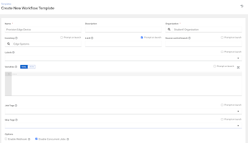
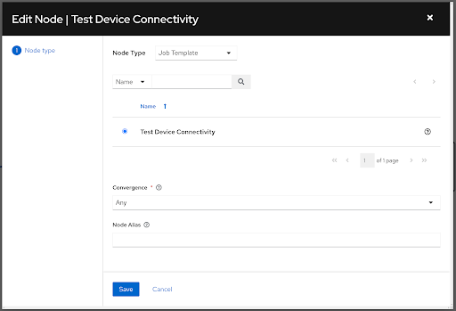

# Workshop Exercise 2.2 - Creating a Kickstart Template

## Table of Contents

* [Objective](#objective)
* [Step 1 - Creating a Workflow](#step-1---creating-a-workflow)
* [Step 2 - Adding Workflow Nodes](#step-2---adding-workflow-nodes)
* [Solutions](#solutions)

## Objective

In this exercise, we're going to build a [jinja2](https://pypi.org/project/Jinja2/) template that'll build us a kickstart file to be used by our edge devices when we provision them. This file allows us to get the operating system down without needing to manually enter values or click through the Anaconda installer.

We're writing this as a jinja2 template so that:
1. Our kickstarts are fundamentally code, kept in source control, etc.
2. We can use Ansible to push them out to anywhere we need them to be.

### Step 1 - Initial Kickstart

The most basic kickstart for Device Edge contains the following:
```
lang en_US.UTF-8
timezone UTC
zerombr
clearpart --all --initlabel
autopart --type=plain --fstype=xfs --nohome
reboot
text
user --name your-user-here --groups=wheel --password=your-password-here
services --enabled=ostree-remount
ostreesetup --nogpg --url=http://1.2.3.4:80/repo --osname=rhel --ref=rhel/8/x86_64/edge
```

Most of these are the defaults for kickstarting standard RHEL, and they apply here to Device Edge as well.

The line that handles the setup of Device Edge is the last one:
`ostreesetup --nogpg --url=http://1.2.3.4:80/repo --osname=rhel --ref=rhel/8/x86_64/edge`

Let's take a look at these options:
1. `ostreesetup` - setup an ostree-based operating system over a traditional RPM-based OS.
2. `--nogpg` - for this lab, we're going to ignore the gpg keys on packages.
3. `--url` - where to go to grab the edge-commit, typically a web server. This can include port, http/https, and where on the server to go (`/repo` for example).
4. `--osname` - the name of the operating system that will be deployed.
5. `--ref` - the ref of the OS being deployed. This can be thought of like a git repo that contains commits instead of code.

The above is just an example, we'll need to tweak this section slightly for our purposes. First, create a new directory in your source control repo: `playbooks/templates`, and in it create a file named `student(your-student-number).ks.j2`, for example: `student10.ks.j2`. Open the file with your editor of choice and add some ansible variables:

```
lang en_US.UTF-8
timezone UTC
zerombr
clearpart --all --initlabel
autopart --type=plain --fstype=xfs --nohome
reboot
text
user --name {{ kickstart_user_username }} --groups=wheel --password={{ kickstart_user_password }}
services --enabled=ostree-remount
ostreesetup --nogpg --url={{ ostree_repo_protocol }}://{{ ostree_host }}:{{ ostree_repo_port }}/{{ ostree_path }} --osname={{ ostree_os_name }} --ref={{ ostree_ref }}
```


```

%post

# create playbook for controller registration
cat > /var/tmp/aap-auto-registration.yml <<EOF
---
- name: register a r4e system to ansible controller
  hosts:
    - localhost
  vars:
    ansible_connection: local
    controller_url: https://10.15.120.50/api/v2
    controller_inventory: Edge Devices
    provisioning_template: Post-Install Edge System
  module_defaults:
    ansible.builtin.uri:
      user: admin
      password: 'R3dh4t123!'
      force_basic_auth: yes
      validate_certs: no
  tasks:
    - name: find the id of {{ controller_inventory }}
      ansible.builtin.uri:
        url: "{{ controller_url }}/inventories?name={{ controller_inventory | regex_replace(' ', '%20') }}"
      register: controller_inventory_lookup
    - name: set inventory id fact
      ansible.builtin.set_fact:
        controller_inventory_id: "{{ controller_inventory_lookup.json.results[0].id }}"
    - name: create host in inventory {{ controller_inventory }}
      ansible.builtin.uri:
        url: "{{ controller_url }}/inventories/{{ controller_inventory_id }}/hosts/"
        method: POST
        body_format: json
        body:
          name: "edge-{{ ansible_default_ipv4.macaddress | replace(':','') }}"
          variables:
            'ansible_host: {{ ansible_default_ipv4.address }}'
      register: create_host
      changed_when:
        - create_host.status | int == 201
      failed_when:
        - create_host.status | int != 201
        - "'already exists' not in create_host.content"
    - name: find the id of {{ provisioning_template }}
      ansible.builtin.uri:
        url: "{{ controller_url }}/workflow_job_templates?name={{ provisioning_template | regex_replace(' ', '%20') }}"
      register: job_template_lookup
    - name: set the id of {{ provisioning_template }}
      ansible.builtin.set_fact:
        job_template_id: "{{ job_template_lookup.json.results[0].id }}"
    - name: trigger {{ provisioning_template }}
      ansible.builtin.uri:
        url: "{{ controller_url }}/workflow_job_templates/{{ job_template_id }}/launch/"
        method: POST
        status_code:
          - 201
        body_format: json
        body:
          limit: "edge-{{ ansible_default_ipv4.macaddress | replace(':','') }}"
EOF
# create systemd runonce file to trigger playbook
cat > /etc/systemd/system/aap-auto-registration.service <<EOF
[Unit]
Description=Ansible Automation Platform Auto-Registration
After=local-fs.target
After=network.target
ConditionPathExists=!/var/tmp/post-installed

[Service]
ExecStartPre=/usr/bin/sleep 20
ExecStart=/usr/bin/ansible-playbook /var/tmp/aap-auto-registration.yml
ExecStartPost=/usr/bin/touch /var/tmp/post-installed
User=root
RemainAfterExit=true
Type=oneshot

[Install]
WantedBy=multi-user.target
EOF

# Enable the service
systemctl enable aap-auto-registration.service

```


Under **Resources**, select the **Templates** page. Once here, click **Add** > **Add workflow template**. Fill in the form with the following information:

<table>
  <tr>
    <th>Parameter</th>
    <th>Value</th>
  </tr>
  <tr>
    <td>Name</td>
    <td>Provision Edge Device</td>
  </tr>
  <tr>
    <td>Organization</td>
    <td>(Your_Student_Organization)</td>
  </tr>
  <tr>
    <td>Inventory</td>
    <td>Edge Systems</td>
  </tr>
  <tr>
    <td>Options</td>
    <td><ul><li>✓ Limit: Prompt on launch</li><li>✓ Enable Concurrent Jobs</li></ul></td>
  </tr>
</table>

Click **Save**

### Step 2 - Adding Workflow Nodes

After saving the workflow, you'll be presented with the workflow visualizer. Click the **Start** button to begin adding nodes.

We're going to add two nodes to our workflow to begin with:
1. Sync our code repo
2. Run the **Test Device Connectivity** job template

These nodes should be connected via an **On-Success** connection in the workflow.

Once you've added the two nodes to the workflow, click the **Save** button in the top right corner.

### Solutions

#### Step 1:



#### Step 2:

##### Sync Code Node:


##### Test Device Connectivity Node:



##### Finished Workflow:


---
**Navigation**

[Previous Exercise](../1.7-coding-intro) | [Next Exercise](../2.2-kickstart-template)

[Click here to return to the Workshop Homepage](../README.md)