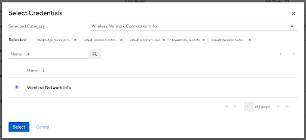

# Workshop Exercise 2.3 - Templating Out Our Kickstart

## Table of Contents

* [Objective](#objective)
* [Step 1 - Writing a Playbook to Template out our Kickstart](#step-1---writing-a-playbook-to-template-out-our-kickstart)
* [Step 2 - Creating a Job Template for our Playbook](#step-2---creating-a-job-template-for-our-playbook)
* [Step 3 - Running the Job Template](#step-3---running-the-job-template)
* [Step 4 - Reviewing the Kickstart File](#step-4---reviewing-the-kickstart-file)
* [Solutions](#solutions)

## Objective

In this exercise, we're going to write a simple playbook to template out our kickstart file, create a job template for it, run the job template, then review the generated kickstart file. Once complete, we should have a functional kickstart ready to use with our edge devices.

### Step 1 - Writing a Playbook to Template out our Kickstart

Return to the code repo via the method that you were editing files (VSCode, VIM, etc) previously, and create a new playbook in the `playbooks/` directory of your repo called `template-kickstart.yml`. We'll only need one task for this playbook which will be used to render the kickstart file to a directory served by the web server.

Populate the `template-kickstart.yml` file with the following content: 


```yaml
---

- name: template out kickstart file
  hosts:
    - all
  become: true
  tasks:
    - name: push templated kickstart file
      ansible.builtin.template:
        src: templates/student{{ student_number }}.ks.j2
        dest: "/var/www/html/student{{ student_number }}-kickstart.ks"
        owner: apache
        group: apache
        mode: '0755'
```


A few notes about this playbook:
- We want `hosts: all` because we'll use Ansible Controller to determine what inventories/hosts to target
- We're going to push this to an already created web server so we can view the results quickly. In addition, for devices on a network, the RHEL boot ISO can be used without modification to kickstart a device by specifying the `inst.ks=` boot option. For more information on this process, refer to this [Red Hat Knowledgebase Article](https://access.redhat.com/documentation/en-us/red_hat_enterprise_linux/8/html/performing_an_advanced_rhel_8_installation/starting-kickstart-installations_installing-rhel-as-an-experienced-user).

Once your playbook is constructed, push it up into your git repo.

### Step 2 - Creating a Job Template for our Playbook

> Note:
>
> Be sure to sync your project in Controller before attempting to create this job template.
> To sync the project, navigate to **Resources** > **Project** and click on the sync icon for the only project available

Now that we have a playbook and template, we can build a job template to push our our kickstart file.

On the **Resources** > **Templates** page, select **Add** > **Add job template** and enter the following information:

<table>
  <tr>
    <th>Parameter</th>
    <th>Value</th>
  </tr>
  <tr>
    <td>Name</td>
    <td>Template Out Kickstart</td>
  </tr>
  <tr>
    <td>Inventory</td>
    <td>Edge Utilities</td>
  </tr>
  <tr>
    <td>Project</td>
    <td>Device Edge Codebase</td>
  </tr>
  <tr>
    <td>Execution Environment</td>
    <td>Device Edge Workshops Execution Environment</td>
  </tr>
  <tr>
    <td>Playbook</td>
    <td>playbooks/template-kickstart.yml</td>
  </tr>
  <tr>
    <td>Credentials</td>
    <td><ul><li>✓ Ansible Controller API Authentication Info</li><li>✓ Machine -> Edge Manager SSH Credentials</li><li>✓ Kickstart User</li><li>✓ OSTree Info</li><li>✓ Wireless Network Info (If applicable)</li></ul></td>
  </tr>
  <tr>
    <td>Limit</td>
    <td>edge_manager</td>
  </tr>
   <tr>
    <td>Options</td>
    <td><ul><li>✓ Privilege Escalation</li></ul></td>
  </tr> 
</table>

Remember to click **Save**.

> Note:
>
> If you're not planning to kickstart over wifi, then the `Wireless Network Info` credential is not needed.

### Step 3 - Running the Job Template

Now that the job template has been created, click on the **Launch** button to start a Job. Monitor the output for any errors or issues.

As a reminder, the output of jobs can be reviewed on the **Jobs** tab.

### Step 4 - Reviewing the Kickstart File

Once the job has completed, the kickstart file can be viewed immediately via connecting to the web server. Open a web browser and navigate to `http://(edge-manager-from-your-student-page)/student$(your-student-number)-kickstart.ks`

Ideally, the variables and conditional blocks will have templated properly, and the kickstart will be filled out with all the correct information. Review the contents of the kickstart to confirm the values you're expecting are present.

Remember: a portion of the playbook was surrounded by the `raw` key, meaning Ansible didn't attempt to resolve/replace the variables and rendered the content as it was declared. This is by design, as our playbook has some of its own variables.

### Solutions

Template Kickstart job template:


Template Kickstart select credentials:



---
**Navigation**

[Previous Exercise](../2.2-kickstart-creds) | [Next Exercise](../2.4-build-iso)

[Click here to return to the Workshop Homepage](../README.md)
