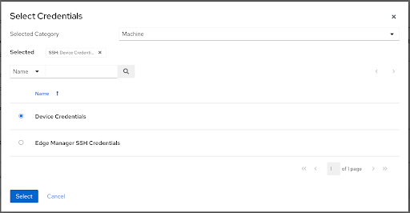
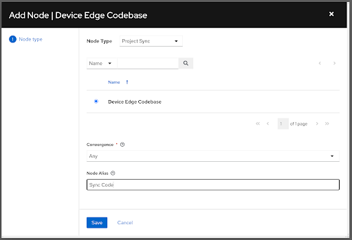
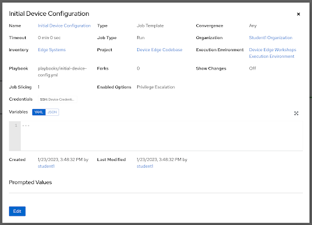

# Workshop Exercise 2.6 - Creating a Provisioning Workflow

## Table of Contents

* [Objective](#objective)
* [Step 1 - Adding Credentials to the Existing Job Template](#step-1---adding-credentials-to-the-existing-job-template)
* [Step 2 - Creating a Workflow](#step-2---creating-a-workflow)
* [Step 3 - Adding Workflow Nodes](#step-3---adding-workflow-nodes)
* [Solutions](#solutions)

## Objective

In this exercise, we're going to build a workflow that will fully deploy our edge devices. We want to perform several steps automatically when the devices boot and call home, so a workflow provides an ideal solution.

The basic idea of a workflow is to link multiple Job Templates together. They may or may not share inventory, playbooks or even permissions. The links can be conditional:

* if job template A succeeds, job template B is automatically executed afterwards
* but in case of failure, job template C will be run.

Workflows are not even limited to executing Job Templates, but can also include project or inventory updates.

This enables new applications for Ansible automation controller: different Job Templates can build upon each other.

### Step 1 - Adding Credentials to the Existing Job Template

A job template has been created by the provisioner with an example playbook that tests connectivity to devices. This job template can be found within the **Resources** > **Templates** page.

Click on the `Test Device Connectivity` template, then select **Edit** at the bottom of the page. Click the mangnifying glass icon next to **Credentials**. In the **Select Credentials** box, ensure **Selected Category** is set to **Machine**, and then select the **Device Credentials** created earler in [exercise 2.2](../2.2-kickstart-creds/). This will allow this job template to authenticate to your edge devices as they're provisioned.

Click **Save** to apply the changes.

### Step 2 - Creating a Workflow

Navigate to the **Resources** > **Templates** page. Once here, click **Add** > **Add workflow template**. Fill in the form with the following information:

<table>
  <tr>
    <th>Parameter</th>
    <th>Value</th>
  </tr>
  <tr>
    <td>Name</td>
    <td>Provision Edge Device</td>
  </tr>
  <tr>
    <td>Organization</td>
    <td>(Your_Student_Organization)</td>
  </tr>
  <tr>
    <td>Inventory</td>
    <td>Edge Systems</td>
  </tr>
  <tr>
    <td>Options</td>
    <td><ul><li>✓ Limit: Prompt on launch</li><li>✓ Enable Concurrent Jobs</li></ul></td>
  </tr>
</table>

Click **Save**

### Step 3 - Adding Workflow Nodes

After saving the workflow, you'll be presented with the workflow visualizer. Click the **Start** button to begin adding nodes.

We're going to add three nodes to our workflow to begin with:
1. Sync our code repo
2. Run the **Test Device Connectivity** job template
3. Run the **Initial Device Configuration** job template

These nodes should be connected via an **On-Success** connection in the workflow.

The resulting workflow should appear similar to the depiction illustrated in the [Finished Workflow](#finished-workflow) portion of the Solutions section.

Once you've added the three nodes to the workflow, click the **Save** button in the top right corner.

### Solutions

#### Step 1:

#### Step 2:

#### Step 3:

##### Sync Code Node:

##### Test Device Connectivity Node:

##### Initial Device Configuration Node:

##### Finished Workflow:

---
**Navigation**

[Previous Exercise](../2.5-device-config-automation) | [Next Exercise](../3.1-boot-edge-device)

[Click here to return to the Workshop Homepage](../README.md)
