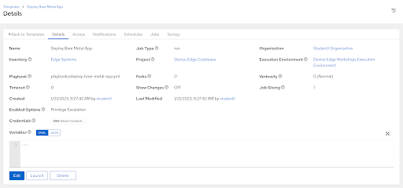

# Workshop Exercise 4.4 - Deploy Bare Metal Application

## Table of Contents

* [Objective](#objective)
* [Step 1 - Creating a Playbook](#step-1---creating-a-playbook)
* [Step 2 - Creating a Job Tempate](#step-2---creating-a-job-template)
* [Step 3 - Running the Job Template](#step-3---running-the-job-template)
* [Solutions](#solutions)

## Objective

In this exercise, we'll create a playbook to run our role, creating a job template for it in Ansible Controller, and deploying the application; all via automation.

### Step 1 - Creating a Playbook

Return to your code repo and create a playbook in the `playbooks` directory called `deploy-bare-metal-app.yml` with the following contents:
```yaml
---

- name: deploy bare metal app to edge device
  hosts: all
  roles:
    - ../roles/deploy_bare_metal_app

```

Once complete, be sure to commit and push your changes up to the repo.

### Step 2 - Creating a Job Template

> **Note**
>
> Be sure to sync your project in Controller before attempting to create this job template.

In the Controller WebUI. under **Resources** > **Templates**, select **Add** > **Add job template** and enter the following information:

<table>
  <tr>
    <th>Parameter</th>
    <th>Value</th>
  </tr>
  <tr>
    <td>Name</td>
    <td>Deploy Bare Metal App</td>
  </tr>
  <tr>
    <td>Inventory</td>
    <td>Edge Systems</td>
  </tr>
  <tr>
    <td>Project</td>
    <td>Device Edge Codebase</td>
  </tr>
  <tr>
    <td>Execution Environment</td>
    <td>Device Edge Workshops Execution Environment</td>
  </tr>
  <tr>
    <td>Playbook</td>
    <td>playbooks/deploy-bare-metal-app.yml</td>
  </tr>
  <tr>
    <td>Credentials</td>
    <td><li>✓ Device Credentials</li></td>
  </tr>
  <tr>
    <td>Limit</td>
    <td><li>✓ Prompt on launch</li></td>
  </tr>
   <tr>
    <td>Options</td>
    <td><li>✓ Privilege Escalation</li></td>
  </tr> 
</table>

Remember to click **Save**.

### Step 3 - Running the Job Template

Now that the job template has been created, click the **Launch** button if you are still within the _Deploy Bare Metal App_ Job Template. Otherwise, click on the rocket ship on the Templates page to launch the job template. Enter your device name when prompted on the limits page. Monitor the output for any errors or issues. However, hopefully the job executes successfully.

As a reminder, the output of jobs can be reviewed on the **Jobs** tab.

Once the playbook completes, visit http://$(your-device-ip-address):1881/ui to view the application running.

> **Note**
>
> For virtualized edge devices, you'll need to use SSH tunneling or just curl the port to check for a response.
> Something like the following might do the trick:
> ssh -L 1881:ip-address-of-the-virtual-edge:1881 student{your-number}@edge-manager.tech-exchange.emea.redhat-workshops.com

Further thoughts: The deployment of the application could be added to the end of our provisioning workflow as soon as a device calls home to simplify the setup and configuration process.

### Solutions




---
**Navigation**

[Previous Exercise](../4.3-bare-metal-app-automation) | [Next Exercise](../4.5-cleanup-bare-metal-app)

[Click here to return to the Workshop Homepage](../README.md)
