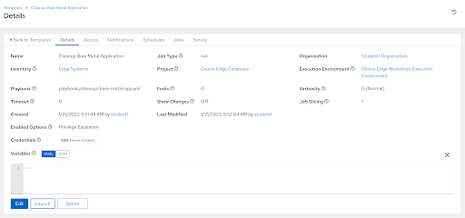

# Workshop Exercise 4.5 - Cleaning Up after the Bare Metal Application

## Table of Contents

* [Objective](#objective)
* [Step 1 - Creating a Playbook](#step-1---creating-a-playbook)
* [Step 2 - Creating a Job Tempate](#step-2---creating-a-job-template)
* [Step 3 - Running the Job Template](#step-3---running-the-job-template)
* [Solutions](#solutions)

## Objective

Because we've deployed the application without concern for security or best practices, we're going to roll back our changes and work towards a containerized deployment approach.

In this exercise, we will create some automation to roll back the changes we've made and cleanup our systems.

### Step 1 - Creating a Playbook

Return to your code repo and create a playbook in the `playbooks` directory called `cleanup-bare-metal-app.yml` with the following contents:
```yaml
---

- name: cleanup bare metal app
  hosts:
    - all
  pre_tasks:
    - name: stop/disable all services
      ansible.builtin.systemd:
        name: "{{ service }}"
        state: stopped
        enabled: false
      loop:
        - ui.service
        - control.service
        - simulator.service
        - mosquitto.service
      loop_control:
        loop_var: service
  tasks:
    - name: remove files/directories
      ansible.builtin.file:
        path: "{{ path }}"
        state: absent
      loop:
        - /var/ui
        - /var/control
        - /var/simulator
        - /etc/mosquitto/mosquitto.conf
        - /etc/systemd/system/ui.service
        - /etc/systemd/system/control.service
        - /etc/systemd/system/simulator.service
      loop_control:
        loop_var: path
    - name: remove packages
      community.general.rpm_ostree_pkg:
        name: "{{ package }}"
        state: absent
      notify: reboot_system
      loop:
        - npm
        - nodejs-typescript
      loop_control:
        loop_var: package
    - name: re-enable selinux
      ansible.posix.selinux:
        state: enforcing
        policy: targeted
    - name: close firewall port
      ansible.posix.firewalld:
        port: 1881/tcp
        zone: public
        permanent: true
        state: disabled
        immediate: true
  handlers:
    - name: reboot the system
      ansible.builtin.reboot:
        reboot_command: systemctl reboot
        reboot_timeout: 300
      listen:
        - reboot_system
```

This playbook rolls back the changes we made previously, mainly removing the packages we installed, files we added/modified, services we created, and re-enables selinux to _enforcing_ mode.

Remember to commit and push your code up to Gitea when finished crafting this playbook.

### Step 2 - Creating a Job Template

> Note:
>
> Be sure to sync your project in Controller before attempting to create this job template.

In the Controller WebUI. under **Resources** > **Templates**, select **Add** > **Add job template** and enter the following information:

<table>
  <tr>
    <th>Parameter</th>
    <th>Value</th>
  </tr>
  <tr>
    <td>Name</td>
    <td>Cleanup Bare Metal Application</td>
  </tr>
  <tr>
    <td>Inventory</td>
    <td>Edge Systems</td>
  </tr>
  <tr>
    <td>Project</td>
    <td>Device Edge Codebase</td>
  </tr>
  <tr>
    <td>Execution Environment</td>
    <td>Device Edge Workshops Execution Environment</td>
  </tr>
  <tr>
    <td>Playbook</td>
    <td>playbooks/cleanup-bare-metal-app.yml</td>
  </tr>
  <tr>
    <td>Credentials</td>
    <td><li>✓ Device Credentials</li></td>
  </tr>
  <tr>
    <td>Limit</td>
    <td><li>✓ Prompt on launch</li></td>
  </tr>
   <tr>
    <td>Options</td>
    <td><li>✓ Privilege Escalation</li></td>
  </tr> 
</table>

Remember to click **Save**.

### Step 3 - Running the Job Template

Now that the job template has been created, click that **Launch** button if still within the _Cleanup Bare Metal Application_ Job Template. Otherwise, click the rocket ship to launch the job template from the _Templates_ page. Enter your device name when prompted witih the limit dialog. Monitor the output for any errors or issues. Hopefully the job executes successfully.

As a reminder, the output of jobs can be reviewed on the **Jobs** tab.

Once the playbook completes, you should no longer be able to access the application as it has been uninstalled.

### Solutions

Our systems are now back to a known good, clean state where we can start our deployment again.



---
**Navigation**

[Previous Exercise](../4.4-deploy-bare-metal-app) | [Next Exercise](../5.1-containerized-image)

[Click here to return to the Workshop Homepage](../README.md)