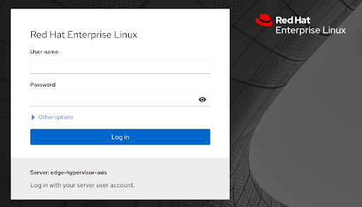
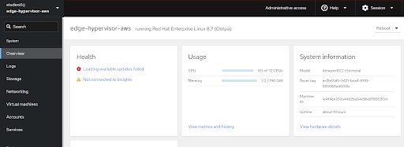
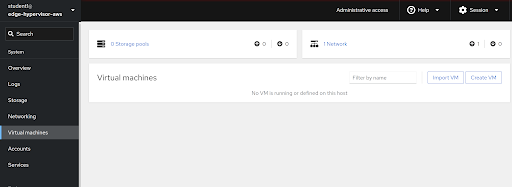

# Workshop Exercise 1.4 - Investigating Your Edge Device

## Table of Contents

* [Objective](#objective)
* [Step 1 - Introduction](#step-1---introduction)
* [Step 2 - Physical Edge Devices Introduction](#step-2---physical-edge-devices-introduction)
* [Step 3 - Edge Hypervisor Introduction](#step-3---edge-hypervisor-introduction)

## Objective

In this exercise, we are going to investigate our edge devices.

This exercise will cover:

* Determining the type of device that is being used
* Validating access to virtual devices if needed

### Step 1 - Introduction

Ideally, you have an edge device at your workstation - a device from OnLogic, Intel NUC, etc, which has power and some peripherals. Depending on the environment, this may not be possible, in which case we'll be using KVM-based virtual machines to emulate an edge device.

- If you have an edge device, proceed to [Step 2](#step-2---physical-edge-devices-introduction)
- If you will be virtualizing an edge device, proceed to [Step 3](#step-3---edge-hypervisor-introduction)

### Step 2 - Physical Edge Devices Introduction

Edge devices are often low power, ARM or x86 based ruggedized devices that favor no moving parts (think: no fans, only fins) over vents and fans like more traditional devices. They often run on 12V (or less) power input and are designed to function in extreme conditions, such as high heat, freezing cold, and corrosive locations. It is very common to have devices operating in very remote locations where human intervention (typically called "rolling a truck") may require an extended journey.

The device at your workstation may or may not match these specifications exactly, but we'll be using it as an approximation of a device that's been deployed to an extremely remote location, such as a wellhead in an oil field, or attached to a high voltage electrical pole.

Despite the differences, there will be similiarities to more traditional devices, such as USB ports, ethernet ports, antennas, etc.

Feel free to investigate the hardware at your workstation, and if you have questions, please notify the lab instructor.
 
### Step 3 - Edge Hypervisor Introduction

An edge hypervisor may have been set up for this workshop to allow for a completely virtual interaction with the lab while still experiencing the device edge stack.

We'll be leveraging KVM and Cockpit on top of Red Hat Enterprise Linux to run our virtual edge devices. The URL and login information can be found on your student page.

> **Note**
>
> The URL will contain a port number (typically `:9090`). Ensure you include it when attempting to access the Cockpit WebUI from a browser.

After accessing the URL, you should be presented with the Cockpit login screen:

After logging in with your credentials, you should be presented with the cockpit dashboard:

Ensure you can access the virtual machines tab:

> **Note**
>
> You have been given sudo access to this machine, so take caution when performing tasks on the hypervisor.

---
**Navigation**

[Previous Excercise](../1.3-source-control-intro) | [Next Exercise](../1.5-application-intro)

[Click here to return to the Workshop Homepage](../README.md)
