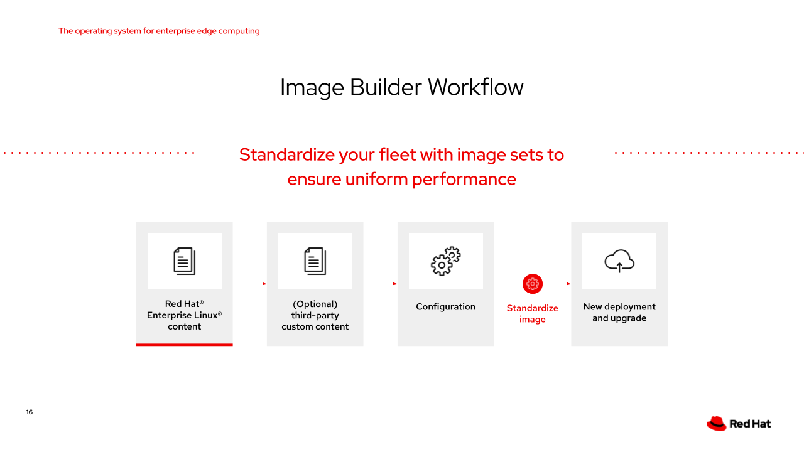

# Workshop Exercise 2.1 - Reviewing the Workflow to Build Images

## Table of Contents

* [Objective](#objective)
* [Step 1 - Reviewing the Code Repo Location](#step-1---reviewing-the-code-repo-location)
* [Step 2 - Cloning Your Code Repo](#step-2---cloning-your-code-repo)

## Objective

In this exercise, we are going to review what Image Builder is, and what the workflow looks like when using it.

This exercise will cover:

* Image Builder's place in building images
* What the build workflow looks like

### Understanding the Workflow to Build Images

Image Builder is the technology used to craft images. Image Builder allows us to take the Red Hat content we're familiar with, optionally add in third-party content and configurations, and then build a standard image to deploy out to our edge systems.Technically, it can create images for multiple compute destinations: AWS, Azure, VMware, and more, however we're interested in the ability to create edge-focused images.

In the next exercise, we'll be building an edge image using Image Builder.

---
**Navigation**

[Previous Exercise](../1.8-image-builder-intro) | [Next Exercise](../2.2-execution-environment-review)

[Click here to return to the Workshop Homepage](../README.md)
