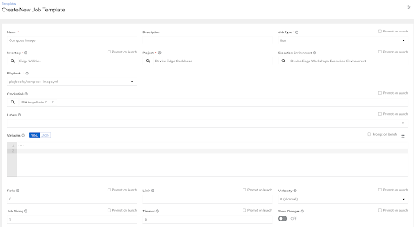

# Workshop Exercise 2.5 - Running Our Playbook through Controller

## Table of Contents

* [Objective](#objective)
* [Step 1 - Syncing Our Project](#step-1---creating-a-playbook)
* [Step 2 - Creating a Job Tempate](#step-2---creating-a-job-template)
* [Step 3 - Running the Job Template](#step-3---running-the-job-template)
* [Additional Information](#additional-information)
* [Solutions](#solutions)

## Objective

In this exercise, we'll sync our project in Ansible Controller, create a job template, and run our new playbook.

### Step 1 - Syncing Our Project

Return to the Ansible Controller WebUI and navigate to **Resources** > **Projects**. Locate the project named **Device Edge Codebase** and click the **Sync Project** button on the right hand side of the page.

For reference, this is the sync button:

After clicking the sync button, the WebUI will show the project syncing and then a success under the **Status** column.

### Step 2 - Creating a Job Template

> **Note**
>
> Be sure to sync your project in Controller before attempting to create this job template.

In the Controller WebUI. under **Resources** > **Templates**, select **Add** > **Add job template** and enter the following information:

<table>
  <tr>
    <th>Parameter</th>
    <th>Value</th>
  </tr>
  <tr>
    <td>Name</td>
    <td>Compose Image</td>
  </tr>
  <tr>
    <td>Inventory</td>
    <td>Edge Utilites</td>
  </tr>
  <tr>
    <td>Project</td>
    <td>Device Edge Codebase</td>
  </tr>
  <tr>
    <td>Execution Environment</td>
    <td>Device Edge Workshops Execution Environment</td>
  </tr>
  <tr>
    <td>Playbook</td>
    <td>playbooks/compose-image.yml</td>
  </tr>
  <tr>
    <td>Credentials</td>
    <td><li>✓ Image Builder Credentials</li></td>
  </tr>
  <tr>
    <td>Options</td>
    <td><li>✓ Privilege Escalation</li></td>
  </tr>
</table>

Remember to click **Save**.

### Step 3 - Running the Job Template

Now that the job template has been created, click the **Launch** button if you are still within the **Compose Image** job template. Otherwise, click on the rocket ship on the Templates page to launch the job template. Monitor the output for any errors or issues. However, hopefully the job executes successfully.

As a reminder, the output of jobs can be reviewed on the **Jobs** tab. Because we're composing an image, this job will take some time to complete, however the images we're using for this workshop have already been built and deployed.

To confirm your image compose is queued/running, log in to the Image Builder WebUI. For a quick refresher, review the [Image Builder Introduction](../1.8-image-builder-intro).

### Additional Information

The best practice here would be to wrap this job template into a workflow, and then have some CI/CD tooling leverate Ansible Controller over the API to automatically build new images and run some tests as the image definition file changes via git updates.

This is a fairly large topic, but Controller is flexible and API driven, so integration with new or existing tooling is straightforward, and allows for best practices.

> **Note**
>
> To speed up the workshop, your instructor has already composed this image for you, so there's no need to wait for the job to finish.

### Solutions

---
**Navigation**

[Previous Exercise](../2.4-using-collection-in-playbook) | [Next Exercise](../3.1-fdo-intro)

[Click here to return to the Workshop Homepage](../README.md)
