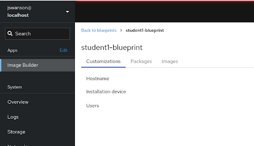
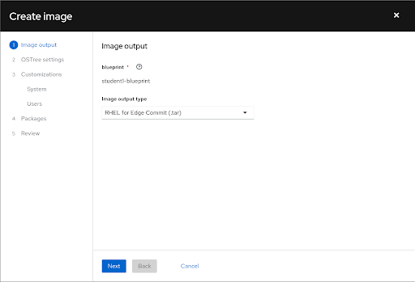
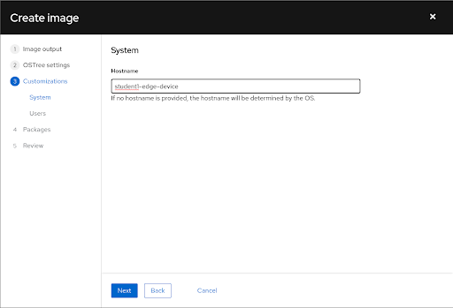
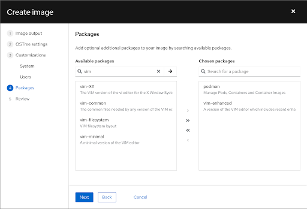
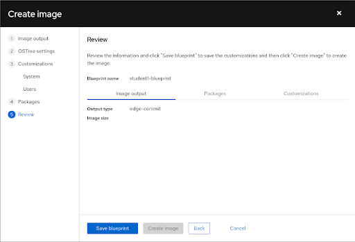
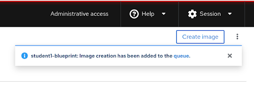

# Workshop Exercise 2.2 - Building an Image via the WebUI

## Table of Contents

* [Objective](#objective)
* [Step 1 - Creating an Empty Blueprint](#step-1---creating-an-empty-blueprint)
* [Step 2 - Starting the Image Creation](#step-2---starting-the-image-creation)
* [Step 3 - Leaving the OSTree Settings Empty](#step-3---leaving-the-ostree-settings-empty)
* [Step 4 - Customizing the System Hostname](#step-4---customizing-the-system-hostname)
* [Step 5 - Customizing Users](#step-5---customizing-users)
* [Step 6 - Adding Packages to the Image](#step-6---adding-packages-to-the-image)
* [Step 7 - Reviewing the Details and Starting the Build](#step-7---reviewing-the-details-and-starting-the-build)
* [Step 8 - Validating the Build Started](#step-8---validating-the-build-started)
* [Solutions](#solutions)

## Objective

In this exercise, we are going to populate a blueprint and trigger an image build using the Image Builder WebUI.

This exercise will cover:

* Creating a blueprint
* Customizing the blueprint
* Creating an image from the blueprint

> **Note**
>
> For a reminder on how to access the Image Builder WebUI, review [exercise 1.8](../1.8-image-builder-intro)

### Step 1 - Creating an Empty Blueprint

In the WebUI, select the **Create Blueprint** button in the top right corner, and enter the following information into the pop-up window:

<table>
  <tr>
    <th>Parameter</th>
    <th>Value</th>
  </tr>
  <tr>
    <td>Name</td>
    <td>student$(your-student-number)</td>
  </tr>
  <tr>
    <td>Description</td>
    <td>Optional string description of your blueprint</td>
  </tr>
</table>

When finished, click the **Create** button.

### Step 2 - Starting the Image Creation

Once the blueprint is created, we'll start the process of building an image from it. This is broken into two parts: modifying the blueprint according to our specifications, and then triggering the build of the image.

Click on the **Create Image** button. In the pop-up window, ensure your blueprint name is displayed, and select `RHEL for Edge Commit (.tar)` for the **Image output type**.

When finished, click the **Next** button.

### Step 3 - Leaving the OSTree Settings Empty

On this window, we have the option of specifying an existing rpm-ostree repository for Image Builder to use to build a new commit off of.

Because we're building a fresh image, all these fields can be left blank, and we can proceed by clicking the **Next** button.

### Step 4 - Customizing the System Hostname

The next two steps focus on customizing the composed image. An important note here: every system built from this image will have these customizations, and while that may be desired, for fleet-wide rollouts it's recommended to have a little customization of the image as possible, and then use post-provisioning automation to configure individual systems.

For our purposes, we will add some image customizations just to showcase functionality.

Under the **Hostname** field, enter `student$(your-student-number)-edge-device`.

Once complete, click the **Next** button.

### Step 5 - Customizing Users

To enable automation against the edge systems as they're provisioned, a user can be added to the image, giving a predictable way to authenticate to new edge systems as they come online.

Enter the following information in the pop-up window:

<table>
  <tr>
    <th>Parameter</th>
    <th>Value</th>
  </tr>
  <tr>
    <td>Username</td>
    <td>ansible</td>
  </tr>
  <tr>
    <td>Password</td>
    <td>$(Kickstart password from your student page)</td>
  </tr>
  <tr>
    <td>SSH key</td>
    <td>-leave empty-</td>
  </tr>
</table>

Once complete, click the **Next** button.

### Step 6 - Adding Packages to the Image

Another common configruation of an image is adding packages. We'll be deploying a containerized workload later in the workshop, however if we were deploying a bare-metal application (or other type of workload), this is where we would add the pre-requisite packages.

To support our containerized workload, we'll add `podman` to the image. In addition, as a creature comfort, we'll add `vim-enhanced`.

To add a package to the image, search for the package in the search bar, highlight the desired package, then click on the right arrow to move the package into the list. For our image, search for `podman` and `vim-enhanced` and add them to the box on the right to add them to our image.

For a visual of this, check out the [solutions](#solutions) below.

Once complete, click the **Next** button.

> **Note**
>
> Podman is always included in edge images, however it is explicitedly stated here to reinforce its presence.

### Step 7 - Reviewing the Details and Starting the Build

The last screen gives us an opportunity to review the customizations we've made before committing the changes to our blueprint and triggering the image build. Use the three tabs to review your selections, then click the **Save blueprint** button.

Once the blueprint is saved, the **Create image** button will become available to click. Click o nthe **Create image** button to start the image build.

### Step 8 - Validating the Build Started

After triggering the build via the **Create image** button, the pop-up window should disappear, and a notification should appear in the top right corner denoting that the build was submitted to the queue.

In addition, on the **Images** tab, a new line item should be present showing the image being built.

> **Note**
>
> Because we're sharing the same Image Builder server, it is normal for your build to remain in the queue for a few minutes while others complete. For the sake of time, images have been pre-built, allowing you to move forward with the lab without delay.

### Solutions

Step 1 - Creating an Empty Blueprint

Step 2 - Starting The Image Creation

Step 3 - Leaving the OSTree Settings Empty

Step 4 - Customizing the System Hostname

Step 5 - Customizing Users

Step 6 - Adding Packages to the Image

Step 7 - Reviewing the Details and Starting the Build

Step 8 - Validating the Build Started

---
**Navigation**

[Previous Exercise](../2.1-image-build-workflow) | [Next Exercise](../3.1-fixme)

[Click here to return to the Workshop Homepage](../README.md)
